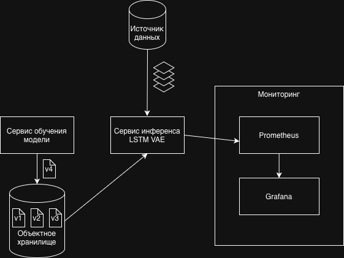
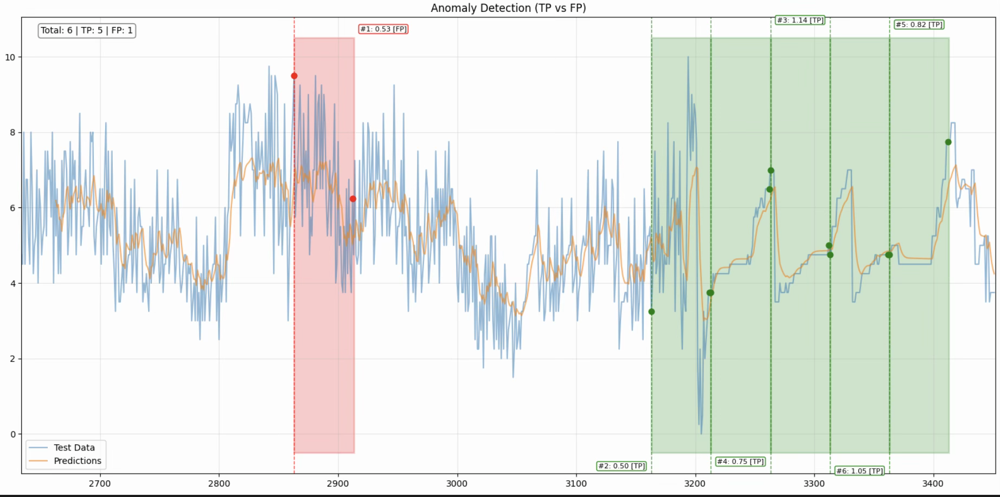

# Система выявления аномалий и дрейфа в потоке данных

Система онлайн-инференса для данных в формате временного ряда, использующая нейросеть архитектуры LSTM RNN Variational Autoencoder с поддержкой раздельного обучения и инференса модели и визуализации метрик и качества модели в режиме реального времени посредством Prometheus и Grafana

## 1. О проекте

Реализация пайплайна выявления аномалий и дрейфа во временных рядах.

Система непрерывно получает данные окнами, выполняет на них инференс с помощью LSTM RNN Variational Autoencoder (LSTM VAE), вычисляет меру аномальности (anomaly score) и поставляет метрики в Prometheus для отображения в режиме реального времени в панелях Grafana.
Для инференса используется самая актуальная версия модели, которая сохраняется в объектное хранилище после каждого запуска обучения.
В любой момент обучить новую модель на новых данных, если, к примеру, мониторинг показал ухудшение качества текущей версии модели.

Основные цели:

- обеспечить наблюдаемость над данными с минимальными задержками
- мочь отслеживать моменты возникновения аномалий и смены распределения в данных
- разработать ML-пайплайн, который может быть интегрирован как модуль в распределенную инфраструктуру
- реализовать механизм переобучения модели, если в данных происходит дрейф и текущая версия нейросети больше не описывает новые данные

## 2. Архитектура системы

## 3. Функционал системы

- онлайн-инференс временных рядов с минимальными задержками
- обработка данных скользящими окнами
- выявление аномалий с помощью модели LSTM RNN Variational Autoencoder
- вычисление anomaly score для каждого окна данных
- отслеживание изменений распределения и признаков дрейфа данных
- раздельные процессы обучения и инференса модели
- сохранение обученных моделей в объектное хранилище
- экспорт метрик и показателей качества модели в Prometheus
- визуализация метрик и anomaly score в Grafana в режиме реального времени
- возможность переобучения модели на новых данных
- интеграция в распределённый ML-пайплайн
- контейнеризация сервисов с помощью Docker

## 4. Стек технологий

- Python
- PyTorch
- MLFlow
- Neural networks: LSTM RNN, Variational Autoencoder
- Prometheus
- Grafana
- Docker
- FastAPI

## 5. Описание модели

Модель для выявления аномалий и дрейфа является автоэнкодером на основе рекуррентной нейросети разновидности LSTM. Она разработана мной как модификация модели, предлагаемой в [работе](https://arxiv.org/abs/1802.04431) и опубликованной в [репозитории](https://github.com/khundman/telemanom), и показала более высокие значения метрик на тестовом датасете.

Модель обучается восстанавливать нормальную структуру временного ряда.
Во время инференса для вычисления меры аномальности используется сумма ошибки реконструкции и меры смещения параметров распределения входящего окна в скрытом пространстве относительно параметров выученного распределения.

Вход:

- скользящее окно временного ряда

Выход:

- anomaly score для каждого окна

## 6. Инференс

1. Данные об активности в формате временного ряда поступают с разбиением на окна
2. Окна подаются в сервис инференса
3. Данные проходят через сеть LSTM VAE
4. Вычисляется anomaly score на основе ошибки реконструкции
5. Метрики передаются в Prometheus
6. Grafana отображает anomaly score в режиме реального времени

## 7. Монитиоринг

Собираемые метрики:

- anomaly score

Панели Grafana отображают

- величину anomaly score во времени
- моменты смены распределения в данных

## 8. Пример инференса

Данные, изображенные на графике выше, представляют собой временной ряд величины загрузки центрального процессора на некотором сервере, нормированной в интервал [0, 10].
Они состоят из двух блоков, разница между которыми составляет ~12 часов.
При инференсе на таких данных был успешно обнаружен момент дрейфа по возрастанию ошибки реконструкции и anomaly score.

## 9. Как запускать

## 10. Планы на будущее

1. Реализовать алертинг, если, например, в системе мониторинга продолжительное время наблюдается высокое значение anomaly score
2. Добавить механизм переобучения по триггеру (например, используя AirFlow), к примеру, когда алертинг присылает уведомление о дрейфе данных