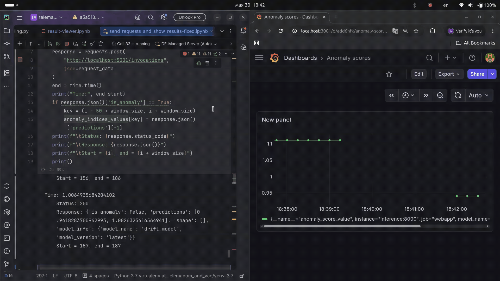

# Система выявления аномалий и дрейфа в потоке данных

Система онлайн-инференса для временных рядов, использующая LSTM Variational Autoencoder для выявления аномалий и дрейфа данных с визуализацией метрик в Prometheus и Grafana.

Важно: в настоящее время проект поддерживается только на машинах с архитектурой x86_64 и
версией python 3.7

## 1. О проекте

Реализация пайплайна выявления аномалий и дрейфа во временных рядах.

Система непрерывно получает данные окнами, выполняет на них инференс с помощью LSTM RNN Variational Autoencoder (LSTM VAE), вычисляет меру аномальности (anomaly score) и передаёт метрики в Prometheus для отображения в режиме реального времени в панелях Grafana.
Для инференса используется самая актуальная версия модели, которая сохраняется в объектное хранилище после каждого запуска обучения.
В любой момент обучить новую модель на новых данных, если, к примеру, мониторинг показал ухудшение качества текущей версии модели.

Основные цели:

- обеспечить наблюдаемость над данными с минимальными задержками
- отслеживать моменты возникновения аномалий и смены распределения данных
- разработать ML-пайплайн, который может быть интегрирован как модуль в распределенную инфраструктуру
- реализовать механизм переобучения модели, если в данных происходит дрейф и текущая версия нейросети больше не описывает новые данные

## 2. Архитектура системы


## 3. Функционал системы

- онлайн-инференс временных рядов с минимальными задержками
- обработка данных скользящими окнами
- выявление аномалий с помощью модели LSTM RNN Variational Autoencoder
- вычисление anomaly score для каждого окна данных
- отслеживание изменений распределения и признаков дрейфа данных
- раздельные процессы обучения и инференса модели
- сохранение обученных моделей в объектное хранилище
- экспорт метрик и показателей качества модели в Prometheus
- визуализация метрик и anomaly score в Grafana в режиме реального времени
- возможность переобучения модели на новых данных
- интеграция в распределённый ML-пайплайн
- контейнеризация сервисов с помощью Docker

## 4. Стек технологий

- Python
- PyTorch
- MLFlow
- Neural networks: LSTM RNN, Variational Autoencoder
- Prometheus
- Grafana
- Docker
- FastAPI

## 5. Описание модели

Архитектура модели основана на подходе, предложенном в работе [работе](https://arxiv.org/abs/1802.04431) и опубликованном в [репозитории](https://github.com/khundman/telemanom), и показала более высокие значения метрик на тестовом датасете.

Модель обучается восстанавливать нормальную структуру временного ряда.
Во время инференса для вычисления меры аномальности используется сумма ошибки реконструкции и меры смещения параметров распределения входящего окна в скрытом пространстве относительно параметров выученного распределения.

Вход:

- скользящее окно временного ряда

Выход:

- anomaly score для каждого окна
- задержка при инференсе

## 6. Почему выбран именно LSTM VAE

Временная структура временных рядов может иметь как глобальные зависимости, например, периодичности, сезонности,
так и более локальные, к примеру, между двумя следующими друг за другом моментами времени.
В связи с этим была выбрана архитектура, которая моделирует данные как на уровне локальных скользяших окон,
так и на уровне распределения последовательностей в скрытом пространстве.

## 7. Инференс

1. Данные об активности в формате временного ряда поступают с разбиением на окна
2. Окна подаются в сервис инференса
3. Данные проходят через сеть LSTM VAE
4. Вычисляется anomaly score на основе ошибки реконструкции
5. Метрики передаются в Prometheus
6. Grafana отображает anomaly score в режиме реального времени

## 8. Мониторинг

Собираемые метрики:

- anomaly score

Панели Grafana отображают

- величину anomaly score во времени
- моменты смены распределения в данных

## 9. Пример инференса


Данные, изображенные на графике выше, представляют собой временной ряд величины загрузки центрального процессора на некотором сервере, нормированной в интервал [0, 10].
Они состоят из двух блоков, разница между которыми составляет ~12 часов.
При инференсе на таких данных был успешно обнаружен момент дрейфа по возрастанию ошибки реконструкции и anomaly score.

## 10. Как запускать

1. Клонируйте репозиторий:
   ```bash
   git clone git@github.com:ArseniyKichkin/mvp.git
2. Перейдите в директорию с Docker Compose:
   ```bash
   cd mvp/mlflow/docker-compose/

3. Создайте файл .env с переменными окружения (используйте .env.dev.example как образец):
   ```bash
   cp .env.dev.example .env

4. Экспортируйте переменные окружения из файла `.env`:
   ```bash
    export $(cat .env | xargs)
   
5. Запустите сервисы в фоновом режиме:
   ```bash
   docker compose up -d

6. Сервис инференса принимает POST-запросы на порту `5001`

7. Вернитесь в корневую директорию проекта:
   ```bash
   cd ~/mvp/

8. Обучение модели можно начать, запустив код
   ```bash
   python ~/mvp/lstm_and_vae/example.py -l labeled_anomalies_shortened.csv
   ```
   Важно: В системе должен быть установлен python3.7. Для запуска обучения нужно
   создать виртуальное окружение:
   ```bash
   python3.7 -m virtualenv venv
   source ~/mvp/venv/bin/activate
   ```
   и установить зависимости
   ```bash
   pip install -r requirements.txt
   ```

## 11. Демо работы


## 12. Планы на будущее

1. Реализовать алертинг, если, например, в системе мониторинга продолжительное время наблюдается высокое значение anomaly score
2. Добавить механизм переобучения по триггеру (например, используя AirFlow), к примеру, когда алертинг присылает уведомление о дрейфе данных